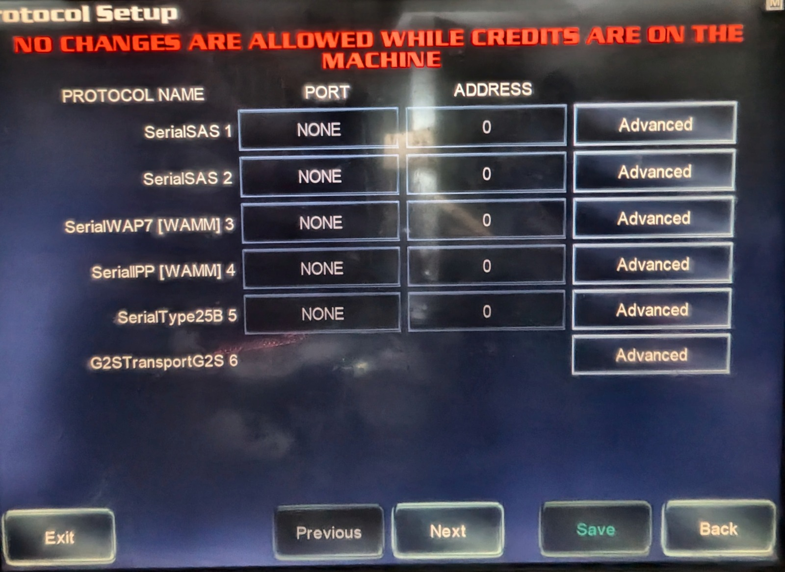
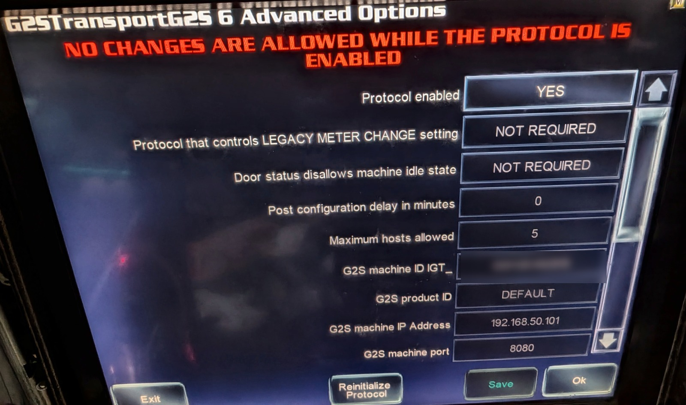
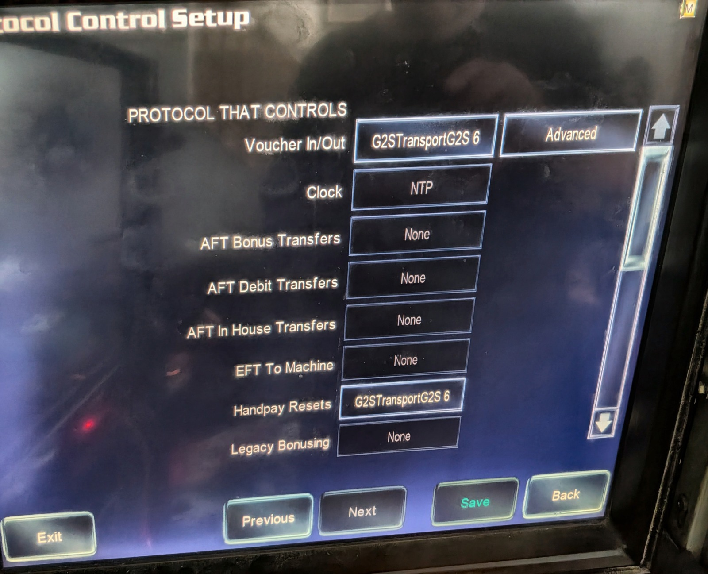
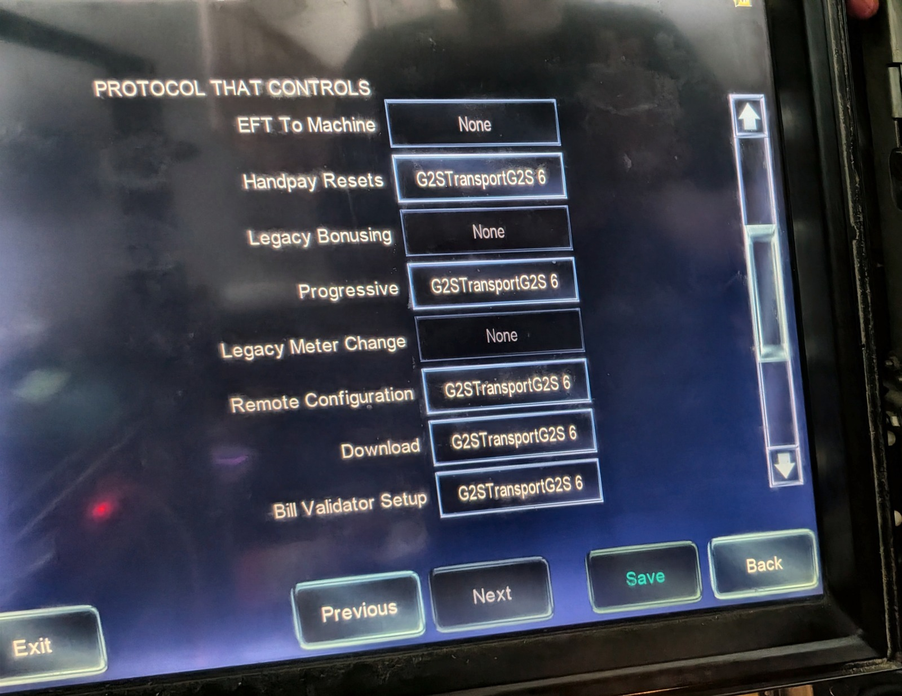
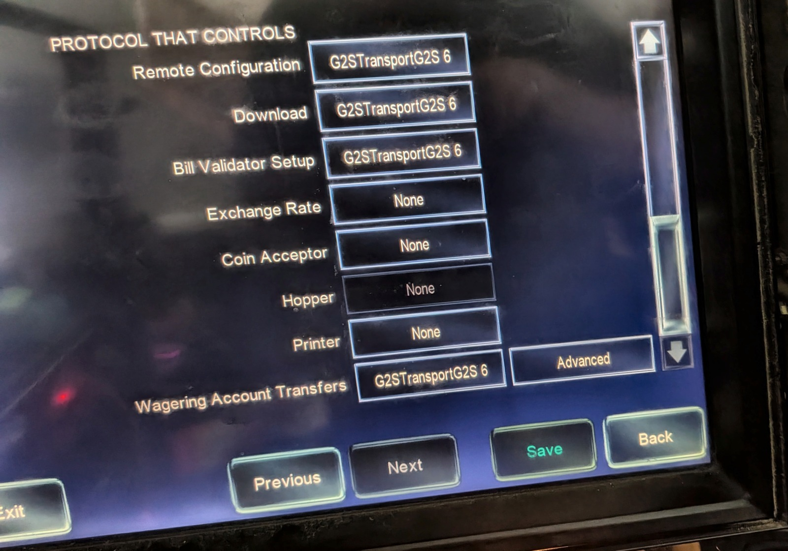
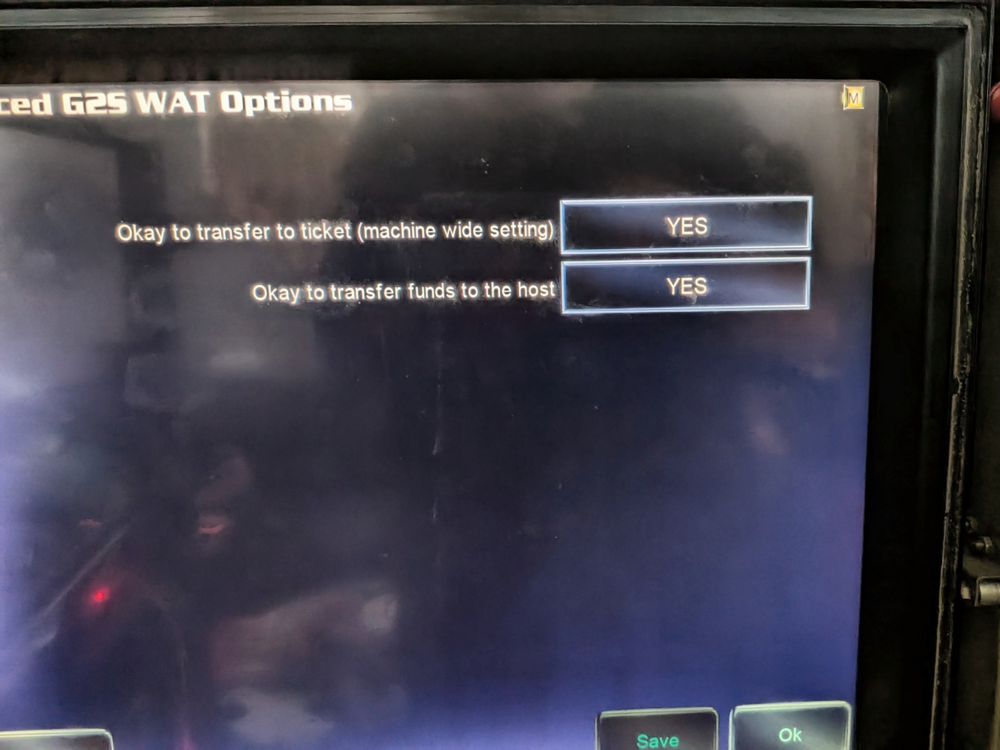
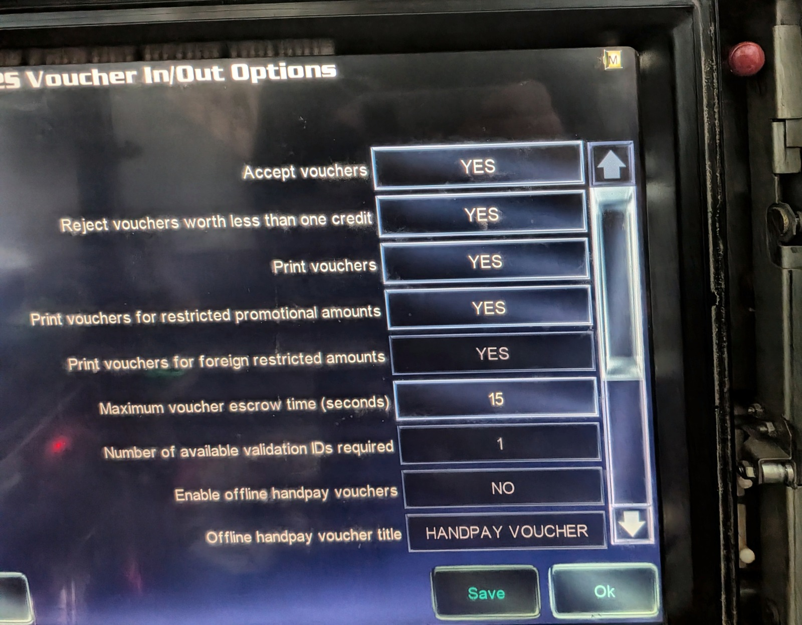
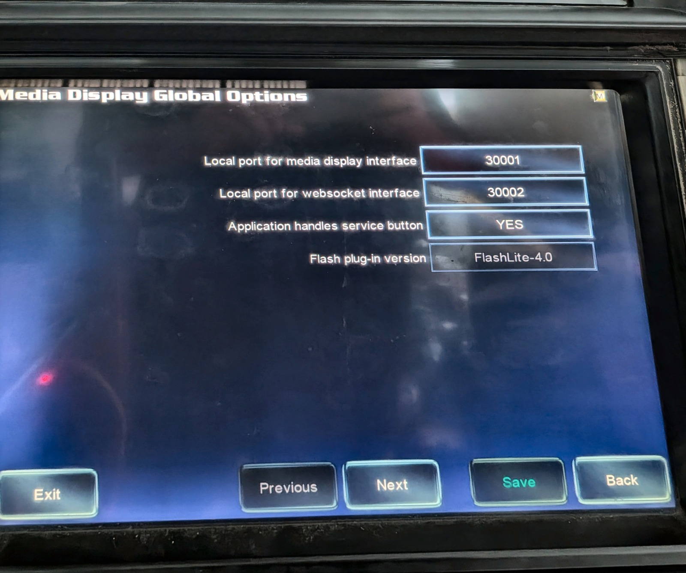
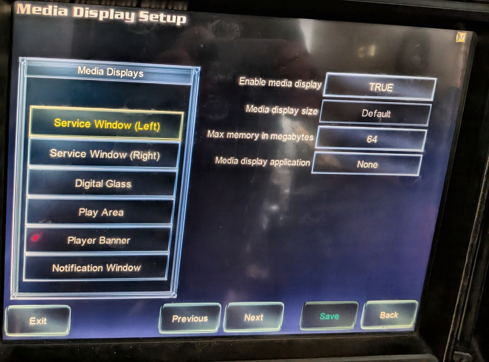

# IGT AVP machine setup — step by step

Everything the machine side needs, with photos from a real AVP (Family 14).
DHCP gives the machine its IP and network settings automatically. Pointing it
at the CabiNet host — the G2S **host URL** — is a **one-time manual entry per
machine** right now (step 1, a few taps). **Automatic host delivery over DHCP
is a work in progress** (see the note at the end). The rest of these steps turn
on the *features*: money permissions and the on-glass UI.

**You need your eKey inserted to change the protocol settings, and the
credit meter must be at zero** — the machine refuses protocol changes while
credits are on it (cash out first).

## 1. Enable G2S and point it at the host

Operator menu: **Setup > Communication > Protocol**.

Tap **Advanced** next to **G2STransportG2S 6** (the name may be numbered
differently on your cabinet). On this screen set, **in this order**:

1. **Override DHCP Configured Host = YES** — this unlocks the host URL fields
   so you can type them.
2. The **three G2S host URI segments** — this is what actually points the
   machine at CabiNet:

   | Segment | Value |
   |---|---|
   | 1 — protocol | `http://` |
   | 2 — G2S host address | your hub's IP (**`192.168.50.2`** on a standard CabiNet slot VLAN) |
   | 3 — path (port + endpoint) | `:8081/G2S` |

3. **Protocol enabled = YES**

The URI fields **lock while the protocol is enabled** (the red banner), so set
the host **before** you flip Protocol enabled — or if it's already on, disable
it, edit, re-enable. The factory default host is `127.0.0.1` (the "unset"
placeholder); the machine sits dark and dials itself until you replace it with
the hub address above. Everything else on this screen can stay default.

## 2. Protocol permissions

Back on the protocol list screen, hit **NEXT** at the bottom — the
**PROTOCOL THAT CONTROLS** pages appear. Set **G2STransportG2S 6** on every
field below (three pages; Previous/Next walks them):

| Field | Notes |
|---|---|
| Voucher In/Out | * |
| Handpay Resets | |
| Progressive | ^ |
| Remote Configuration | |
| Download | |
| Bill Validator Setup | |
| Wagering Account Transfers | * — **see warning below** |

\* — once G2STransport is set, the **Advanced** button next to the field
opens machine-level options you may set to your liking (ticketing
permissions, for example).
^ — not used by CabiNet yet; set it now for future features.

> ⚠️ **Wagering Account Transfers — Advanced is NOT optional.** Both
> settings must be **YES** or wallet↔machine transfers won't work:
>
> 

Voucher In/Out's Advanced page is where your ticketing preferences live —
set to taste:

## 3. Enable the glass (on-machine UI)

Operator menu: **Setup > Machine > Media Display**. Two settings:

**Media Display Global Options** → **Application handles service button =
YES** (this is what lets the cabinet's SERVICE button open and close the
CabiNet menu):

**Media Display Setup** → select **Service Window (Left)** → **Enable media
display = TRUE**:

That's the one window CabiNet uses — leave the other five alone.

## Done

Exit the operator menu, **remove the eKey, and close the logic door**. With the
host URL set in step 1, the machine connects and joins — watch its tile go
**Connecting…** then **LIVE** on the floor view — but it stays in **tilt**
until the key is out and the door is shut, so it'll look like nothing's
working even though it already joined. If the endpoint stays dark after you
changed comm settings, re-enable G2S in the debug menu (see `DEPLOY.md`).

## Automatic host setup (DHCP) — work in progress

The goal is plug-and-play: the machine gets its host URL from DHCP with **zero**
taps. DHCP already hands out the IP and network settings that way — but the
host-URL half isn't landing reliably on Family 14 AVP firmware yet (it's under
active development), so **set the host manually per step 1 for now**. It's a
one-time, per-machine step. Progress is tracked in the repo issues; when it's
solid, step 1 collapses to "just enable G2S."
